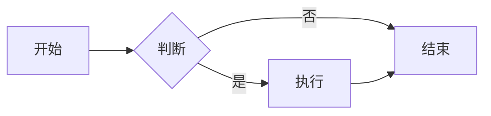
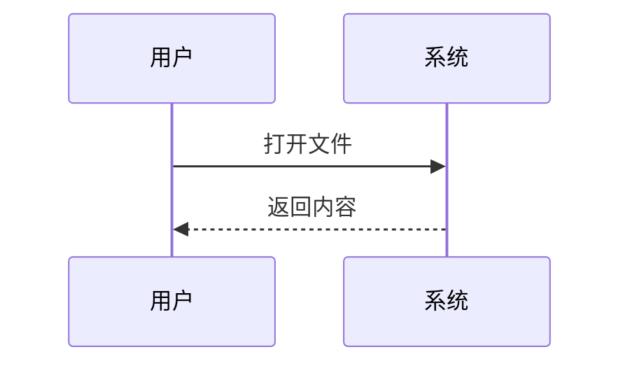
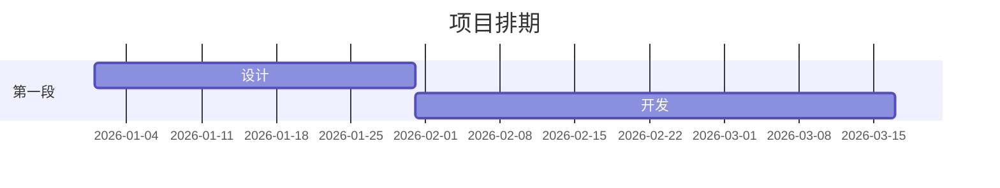
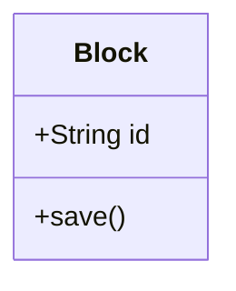

# 图表

```mermaid
flowchart LR
  A[开始] --> B{判断}
  B -->|是| C[执行]
  B -->|否| D[结束]
  C --> D
```

```mermaid
sequenceDiagram
  participant 用户
  participant 系统
  用户->>系统: 打开文件
  系统-->>用户: 返回内容
```

```mermaid
gantt
  title 项目排期
  dateFormat YYYY-MM-DD
  section 第一段
  设计 :a1, 2026-01-01, 30d
  开发 :after a1, 45d
```

```mermaid
classDiagram
  class Block {
    +String id
    +save()
  }
```
